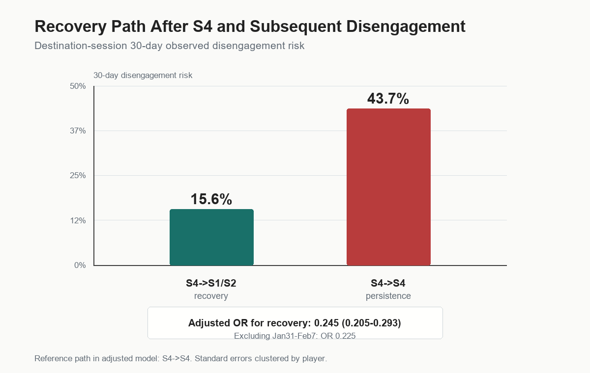
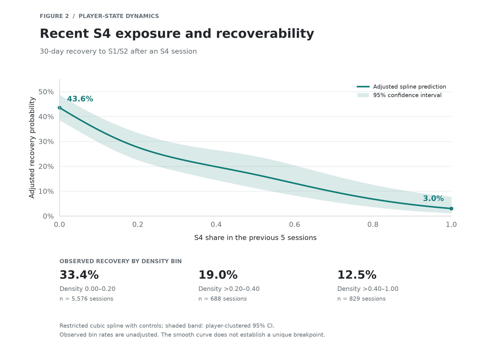

# Player Behavior State Dynamics

This repository contains a reproducible analysis pipeline for discovering session-level behavioral states in *PowerWash Simulator: Research Edition* telemetry and testing how those states relate to player disengagement and recovery.

**Main takeaway:** Low engagement is not inherently terminal. The stronger signal is whether players can recover from it, and recoverability progressively declines as minimal-engagement episodes accumulate in recent play history.

## Research Question

What distinguishes temporary low engagement from behavioral trajectories associated with persistent disengagement?

We test whether the key signal is low-engagement exposure itself, persistence in that state, or a progressive loss of recoverability as low-engagement episodes accumulate.

## Method

The analysis proceeds from raw telemetry to player-level state dynamics:

1. **Session reconstruction.** `player_logged_in` and `exited_game` events are paired into reconstructed sessions. The main reconstruction yields **105,818 paired sessions**, and reconstructed duration closely matches `CurrentSessionLength`.
2. **Session feature engineering.** Event tables are assigned back to sessions and compressed into a V1 feature table with duration, recency, job/task activity, progression, purchases, and mode diversity.
3. **State discovery.** Standardized V1 features are validated with PCA, then clustered using KMeans and diagonal-covariance GMM across `K=2..8`. The frozen V1 representation uses `pc1_pc5_gmm_diag_k5`.
4. **State transition analysis.** Player-level state sequences are constructed and summarized as 5x5 transition matrices, including main, update-window-excluded, and player-balanced versions.
5. **Disengagement and recovery analysis.** Observed disengagement is defined using right-censored 7d, 14d, and 30d return windows. Recovery is analyzed as transition from S4 to S1/S2 after a minimal/no-op S4 session.

## State Interpretation

The state labels are post-hoc descriptions of the frozen K5 GMM clusters. These labels are descriptive summaries of empirically discovered clusters rather than predefined psychological categories.

- **S0:** first-session productive start state. This cluster is strongly first-session-heavy, mostly Career mode, with moderate-long sessions, job starts, task completions, and progression.
- **S1 — Active Progression State:** sustained active gameplay characterized by longer sessions, regular job/task activity, progression, and relatively high persistence.
- **S2 — Lower-Activity / Resumption State:** shorter continuation/resumption sessions with lower task activity and progression than S1. Despite lower activity, S2 frequently transitions back to S1 and is not interpreted as disengagement.
- **S3 — Broad / Multi-Mode Activity State:** longer, relatively intensive sessions characterized by greater job/task activity and higher mode diversity; comparatively uncommon and more transient than S1/S2.
- **S4:** minimal/no-op state, characterized by very short sessions, little or no job/task/item activity, and mostly missing mode information. This is the focal low-engagement state.

S1 and S2 form the main continuing-play backbone, while S3 represents a less common, broader multi-mode activity regime.

## Core Figures





## Key Findings

### 1. Recovery Path Matters More Than S4 Exposure Alone

Among destination sessions after S4:

- `S4->S1/S2` recovery path: **15.65%** 30d observed disengagement risk.
- `S4->S4` persistence path: **43.73%** 30d observed disengagement risk.

Adjusted logistic regression confirms this difference. With `S4->S4` as the reference, recovery to S1/S2 has an adjusted odds ratio of **0.245** for 30d disengagement, with the effect remaining strong in 7d, 14d, and Jan31-Feb7-excluded analyses.

### 2. Recoverability Declines as Recent S4 Exposure Accumulates

Recent S4 density in the previous five sessions shows a strong association with subsequent recovery. In the empirical threshold scan, sessions with recent S4 density below 0.5 had a **31.80%** 30-day recovery probability, compared with **12.55%** at or above 0.5. However, the continuous spline analysis suggests that the broader pattern is a progressive decline rather than a uniquely defined breakpoint.

Adjusted predicted recovery declines from **43.6%** at density 0.0 to **27.6%** at 0.2, **16.6%** at 0.5, **6.8%** at 0.8, and **3.0%** at 1.0.

### 3. A Minimal/No-Op State Exists

The K5 GMM state representation contains a distinct S4 cluster with very short sessions, near-zero job/task/item activity, and mostly missing mode information. This pattern survives removing the Jan31-Feb7 update window and also appears when refitting only on the pre-Jan31 regime.

Jan31 2023 creates a clear spike in minimal/no-op sessions, likely associated with a game/research-branch update and telemetry regime change. However, sensitivity tests show the state is not created by that update alone.

### 4. State Transitions Support a Reversible Low-Engagement State

Transition structure remained broadly stable under update-window exclusion and player-balanced analyses. Importantly, S4 showed both persistence and recovery, supporting its interpretation as a reversible minimal-engagement state rather than a terminal state.

Under update-window exclusion and player-balanced transition weighting, S4 self-persistence decreased while transitions from S4 back to S1/S2 increased.

### 5. Behavioral Narrowing Is Not Yet Disengagement-Specific

Terminal disengagers show lower state entropy and fewer unique states near their final observed sessions. However, matched active controls show comparable lifecycle-related narrowing. After matching and adjustment, V1 state-space narrowing cannot yet be claimed as a disengagement-specific signal.

## Robustness

The analysis includes several robustness checks:

- **Session reconstruction audit:** verifies session counts, player counts, timestamp ranges, missingness, and login-exit pairing quality.
- **Date-regime sensitivity:** removes Jan31-Feb7 2023 and refits GMM K5; the minimal/no-op cluster reappears.
- **Pre-update refit:** uses only Aug18 2022-Jan30 2023 data; the minimal/no-op cluster still appears.
- **Purchase anomaly audit:** flags rare minimal sessions with unusually high purchase bursts so they do not drive interpretation.
- **Transition robustness:** compares main, update-window-excluded, and player-balanced transition matrices.
- **Disengagement censoring:** evaluates 7d, 14d, and 30d observed disengagement while excluding sessions that cannot be evaluated.
- **Adjusted recovery models:** compare `S4->S1/S2` against `S4->S4` with lifecycle, recency, history, month, and update-window controls.
- **Continuous recoverability model:** estimates `Recovery ~ f(recent_S4_density_prev5) + controls` using a restricted cubic spline and overlays empirical binned recovery rates.

## Limitations

- The state labels are unsupervised and descriptive. They should be interpreted as behavioral regimes, not ground-truth psychological states.
- The Jan31 2023 update period likely changed telemetry and player onboarding conditions. Sensitivity analyses reduce this risk but cannot fully remove all regime-change effects.
- Observed disengagement is based on return behavior within the dataset window. It is not a direct measure of player intent.
- `observed_lifecycle_position` is useful descriptively but is hindsight-based and should not be treated as an ex-ante predictor.
- Recent S4 density is discrete in a 5-session window. Spline curves are useful summaries but should be read alongside empirical binned points.
- V1 features are intentionally compact. More granular telemetry such as subtasks, menu/tool switching, movement rhythm, or subjective reports may reveal mechanisms that V1 cannot resolve.

## Reproducible Pipeline

Install the lightweight Python dependencies with:

```powershell
python -m pip install -r requirements.txt
```

Then run the full pipeline from raw telemetry:

```powershell
.\run_pipeline.ps1 `
  -Python "python" `
  -RawZip "C:\path\to\data.zip" `
  -RawDataDir "C:\path\to\data\data"
```

The same paths can be supplied with `PWS_RAW_ZIP` and `PWS_RAW_DATA_DIR`. See `ARTIFACT_MANIFEST.md` for the claim-to-artifact map.

- `step1_data_audit.py`: audits source event tables and reconstructs sessions.
- `step2_v1_session_features.py`: builds session-level V1 features.
- `step2_v1_feature_diagnostics.py`: produces feature diagnostics and `state_discovery_input_v1.csv`.
- `step3_pca_validation.py`: validates transforms, standardizes features, runs PCA, and exports PCA plots/loadings.
- `step3_2_cluster_evaluation.py`: evaluates KMeans and GMM across `K=2..8`.
- `step3_3_cluster_profiles.py`: profiles candidate clusters.
- `step3_4_gmm_posterior_stability.py`: checks posterior confidence and seed/subsample stability.
- `step3_5_minimal_session_cluster_audit.py`: audits the minimal/no-op cluster.
- `step3_6_date_regime_sensitivity.py`: tests date-regime sensitivity and purchase anomalies.
- `step4_1_state_sequences.py`: builds player state sequences and transition matrices.
- `step4_2_transition_robustness.py`: compares transition robustness specifications.
- `step5_disengagement_definition_risk.py`: defines observed disengagement and descriptive risk.
- `step5_2_logistic_disengagement.py`: tests adjusted S4 persistence risk.
- `step5_3_recovery_path_analysis.py`: describes S4 recovery and persistence paths.
- `step5_3_adjusted_recovery_path_model.py`: tests adjusted recovery-vs-persistence risk.
- `step5_4_behavioral_rigidity.py`: computes rolling behavioral rigidity metrics.
- `step5_5_behavioral_narrowing_test.py`: compares terminal disengagers with matched active controls.
- `step5_6_recovery_tipping_point.py`: scans recovery threshold patterns.
- `step5_7_recovery_spline_model.py`: estimates nonlinear recoverability curves.
- `make_core_figures.py`: exports the two core README figures.

## Main Outputs

- `figures/`: core figures for recovery-vs-persistence and recoverability curves.
- `step1_audit/`: data audit and reconstructed sessions.
- `step2_v1/`: V1 session features and modeling input.
- `step3_pca/`: PCA reports, scores, loadings, and plots.
- `step3_2_cluster_evaluation/`: clustering metrics and labels.
- `step3_6_date_regime_sensitivity/`: date-regime and anomaly sensitivity reports.
- `step4_1_state_sequences/`: state assignments and transition matrices.
- `step4_2_transition_robustness/`: robust transition matrix comparisons.
- `step5_3_adjusted_recovery_path_model/`: adjusted recovery-vs-persistence models.
- `step5_6_recovery_tipping_point/`: threshold scans and recovery probability plots.
- `step5_7_recovery_spline_model/`: nonlinear recovery curve model and figure.

## Data Note

Raw telemetry is not redistributed in this repository. The analysis is designed to run from the publicly available *PowerWash Simulator: Research Edition* dataset, while this repository contains the analysis code and derived outputs needed to reproduce the reported results.
